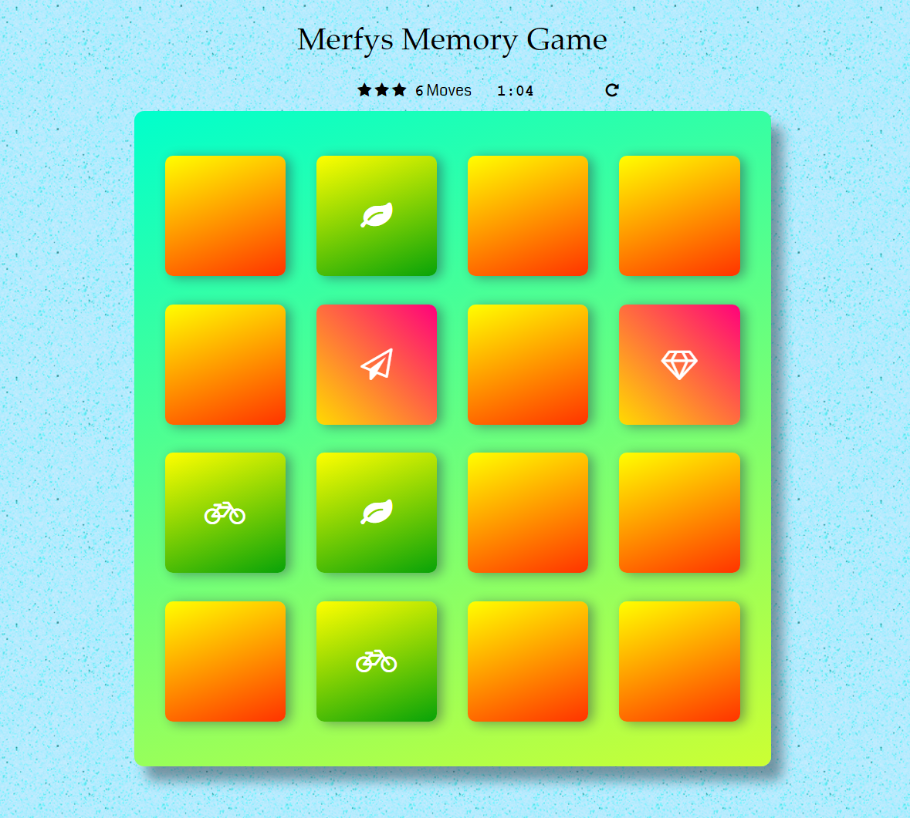
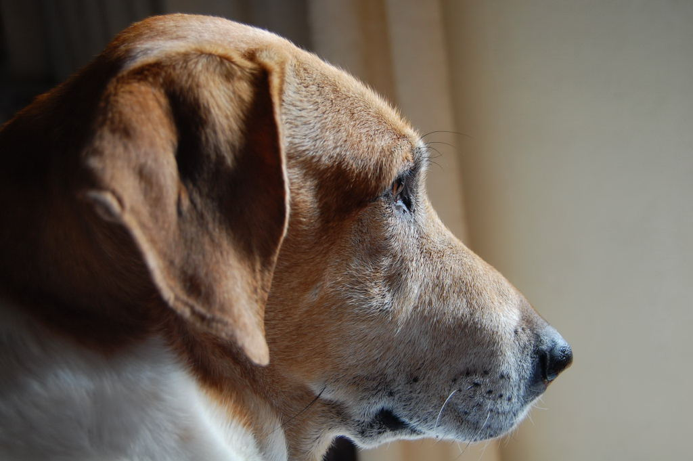

# Merfys Memory Game

This is a memory game to test how good you are at remembering things.

## How to start

You can play this game online: [Merfys Memory Game](https://antzm.github.io/merfys-memory-game/)

or, if you prefer, you can download the game:

1. Download the zip file named merfys-memory-game.zip

2. Unzip the file and open the folder

3. Double click on the file index.html to start the game

_Note: Internet connection is required for playing this game_

## Rules of the Game

The game consists of 16 cards (8 pairs of cards) and your purpose is to match all the cards, in the least amount of time and with the least number of moves!

You start by clicking a card, which then opens, and then another card, which also opens.

The two cards are compared:

* If they match, the color of the two cards changes and the two cards remain open, and you continue the game
* If the two cards don't match, they will close, and you continue the game

This repeats until all the cards match.

## Game complete

 When you match the 8 card pairs, the game ends and:

 * All the cards remain open
 * The timer stops counting
 * A modal appears, and it informs you about:
    * Your total moves
    * The time that took you to complete the game
    * The number of your stars, which is your score

When the modal appears, you are also asked if you would like to play another game.

## New Game

A new game can start:

* At the end of a game by confirming, in the modal, that you would like to play another game
* Any time by clicking the reset icon on the top of the board

Whenever a new game starts, the following actions take place:

* [x] The deck of cards resets
    * [x] All the cards close
    * [x] The card's placement is randomized
* [x] The 'Moves' counter resets
* [x] The game timer resets

## Score calculation

Your score consists of 3 stars and depending on the number of your moves, the score changes.

The score is calculated in the following way:

Number of moves | Number of stars
 -------------- | ---------------
 less than 18   | 3 stars
 less than 26   | 2 stars
 26 and above   | 1 star

## Moves

Every time you open a pair of closed cards, your moves increase by 1.

The moves increase either if the cards you opened match, or they don't match.

At the end of the game, your moves appear in the modal and when you start a new game, or whenever you click the reset game icon, the 'Moves' counter resets.

## Game timer

 When the game starts, a timer runs on the upper side of the board showing elapsed minutes and seconds. It uses the format 0:00 (minutes : seconds).

 When all the cards are matched and the game ends, the timer stops. If you would like to play another game though, the timer will reset and start again.

 The timer also resets whenever you click the reset icon, on the top of the board, to start a new game.

## Dependencies

This game uses the following files:

* index.html
* js/app.js
* css/app.css
* img/turquoise.jpg
* README.md
  * img/merfys-memory-game.png
  * img/DSC_6274.JPG

And also:

* [font: Awesome](https://maxcdn.bootstrapcdn.com/font-awesome/4.6.1/css/font-awesome.min.css)
* [font: Coda](https://fonts.googleapis.com/css?family=Coda)

## Code license

If you like this game, you can have a look and see how the `code` of this game looks like.

If you would like to use this `code`, or just a part of it (for something you would like to create), then please respect the terms of the **"Merfys Pet License"** mentioned below:

_Merfys contemplates about the terms of the "Merfys Pet License"..._

_Terms of license:_

This `code` can be freely used under the **"Merfys Pet License"**. As you can see, Merfys is a dog, so the main term of the license is that you are respectful towards dogs, cats and any other pet, either if you have one or not.

Sounds strange, but if you love pets and respect them, chances are that you would also respect other people, and in this case, people who write `code`, and so you will use their `code`, with respect towards every one of them, with respect towards you, and also with respect towards the pets you care about.

>_Let a pet in your life be proud of who you are!_